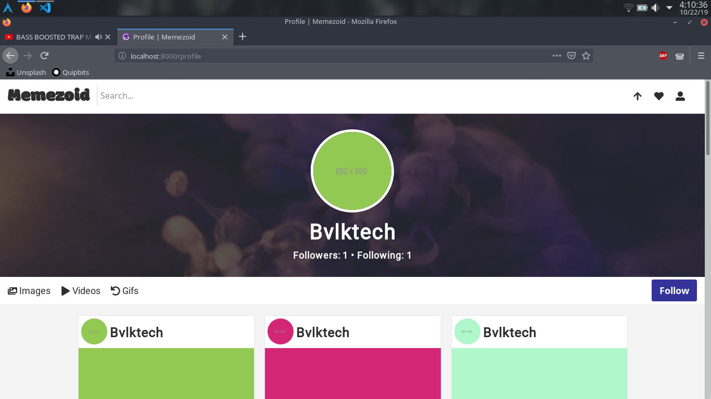

# Memezoid
Share Memes with the world.

<p align='center'>
  
</p>

[](https://app.netlify.com/sites/memezoid/deploys)

## Prerequisites

- [Node](https://nodejs.org/en/docs/) (Recommend using v12.10.0 or higher)
- [Yarn](https://yarnpkg.com/en/docs) (Recommend using v1.17.3 or higher)
- [Gatsby CLI](https://www.gatsbyjs.org/docs/) (Recommend using v2.7.50 or higher)

## Access Locally
```
$ git clone https://github.com/bvlktech/Memezoid.git
$ cd Memezoid/client
$ yarn
$ cd ../
$ yarn
$ yarn dev
```

This will install all the required dependencies for both the Frontend & Backend as well as start both of the development servers thanks to `concurrently` you can view the Frontend in the browser by going to [http://localhost:8000](http://localhost:8000). And the backend by going to [http://localhost:5000/api](http://localhost:5000/api) The page will automatically reload if you make changes to the code. You will see any build errors and lint warnings in the console as shown below.

<p align='center'>
  
</p>

## Contributing

Contributions are always welcome, no matter how large or small. just make a PR(:
